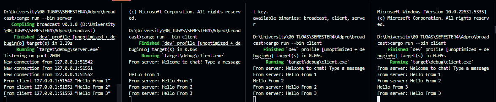

# Reflection 

## 2.1 Original code of broadcast chat

To run the server, we run `cargo run --bin server` and to run the client, we run `cargo run --bin client` 

We have implemented a websocket communication between the server and the client. When any client sends a message, it will be broadcasted to all clients. We can see for each messages sent by a client, the message is broadcasted to all clients.